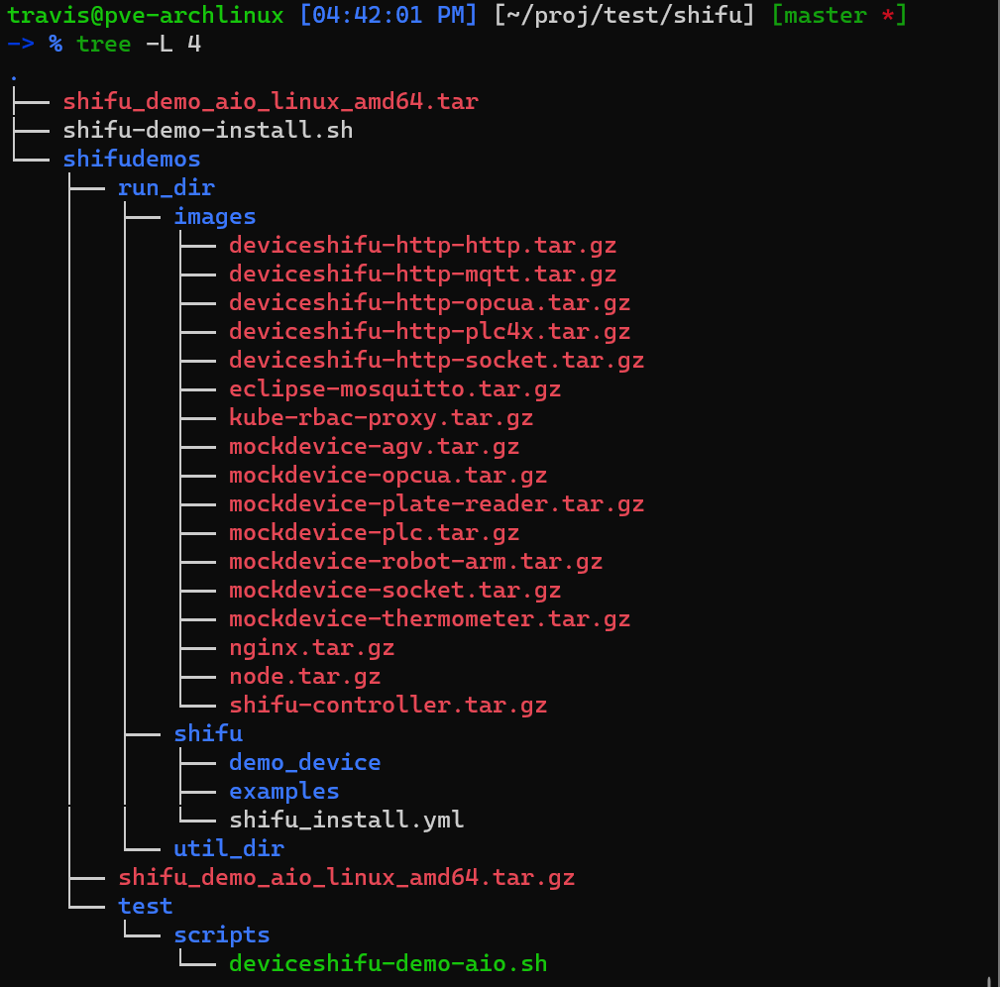
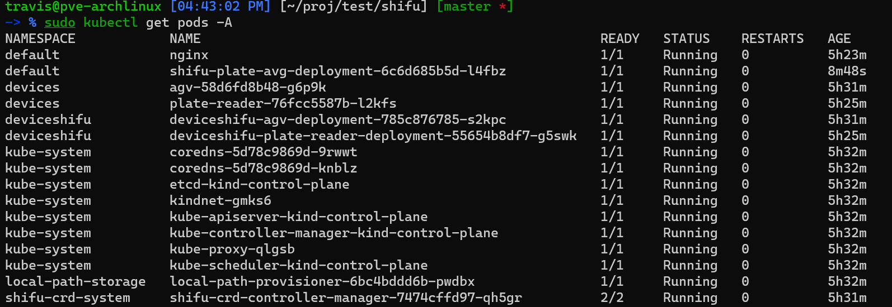
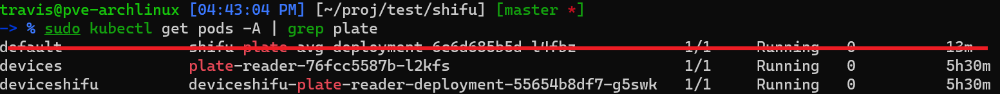
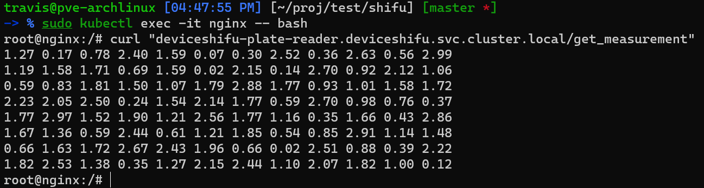
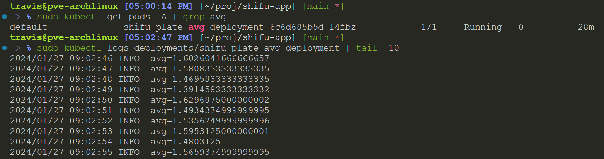

## 1. 部署安装 shifu

按照步骤安装 shifu，截图如下




shifu 的各个组件成功安装。

## 2. 创建酶标仪数字孪生




可以看到，已经成功安装，并且运行成功了。

## 3. 编写一个 Go 应用

目录结构如下

```txt
.
├── cmd
│   └── main.go            # 入口函数
├── internal
│   └── plate
│       ├── plate.go       # 计算平均值的具体实现
│       └── plate_test.go
├── deployment.yaml
├── dockerfile
├── go.mod
└── readme.md
```

镜像已上传至 `ghcr`，可以使用 `ghcr.io/travisroad/shifu-plate-avg:v0.0.2`

该程序能读取两个环境变量

```bash
# 酶标仪数字孪生的 api
PLATE_ENDPOINT='http://deviceshifu-plate-reader.deviceshifu.svc.cluster.local/get_measurement'
# 轮询时间，单位是 ms，默认为 1000ms
INTERVAL=1000
```



从图中可看到，符合预期。1000ms 会轮询一次。
